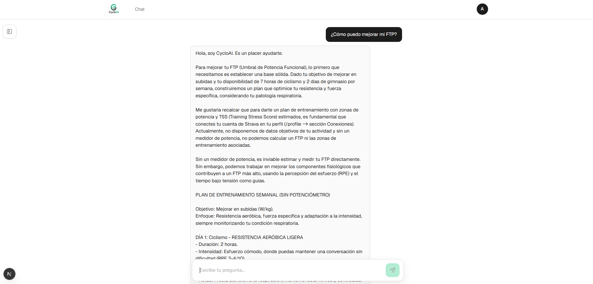

# CycloAI

**Tu entrenador personal de ciclismo, potenciado por IA.**


CycloAI cruza tus datos reales de entrenamiento con una base de conocimiento deportiva
para generar planes de ciclismo, gimnasio y nutrición **que no se inventan nada**: cada
sesión se valida contra un esquema antes de llegar a vos, y si no valida, no se entrega.

---

## El problema que resuelve

Un modelo de lenguaje puede escribir un plan de entrenamiento convincente y equivocado:
zonas que no existen, duraciones imposibles, un FTP que nadie midió, una progresión de
carga que te lesiona.

CycloAI está diseñado para que eso **no pueda pasar**:

- **El modelo no puede escribir números absolutos.** Solo emite **códigos de zona**; los
  vatios o las pulsaciones se derivan después, de *tus* umbrales. Nunca inventa un `bpm`.
- **Dos sistemas de zonas, nunca mezclados.** Entrenamiento por **potencia** (%FTP) o por
  **pulso** (%LTHR): vos elegís cuál en el onboarding y el sistema prescribe en ese. Sin
  conversiones entre ambos, porque la relación es individual y cambia con la forma física.
- **Cada cita tiene que existir.** Lo que el coach afirma sobre entrenamiento se apoya en
  fragmentos recuperados de la base de conocimiento, y una cita que no esté en lo recuperado
  se rechaza como fabricada.
- **Validación determinista.** Reglas duras (coherencia de zonas, duración total,
  calentamiento y vuelta a la calma, progresión de carga, TSB) más **fixtures doradas** que
  fijan el comportamiento del parser de corpus.
- **Fail closed.** Si la salida no valida tras un reintento, se devuelve el error con los
  hallazgos. Nunca un plan a medias.

La captura de abajo no es un ejemplo de lo que el sistema *puede* hacer: es lo que hace
cuando le pedís algo que no puede calcular.



---

## Capturas

| | |
| --- | --- |
| **Landing** | `public/img/1.png` |
| **Inicio de sesión** | `public/img/2.png` |
| **Chat (escritorio)** | `public/img/img1.png` |
| **Chat (móvil)** | `public/img/img.png` |
| **Coach respondiendo sin herramientas** | `public/img/img2.png` |


---

## Stack

| Capa | Tecnología |
| --- | --- |
| Frontend | Next.js 16 (App Router), React 19, Tailwind |
| Backend | **Python 3.13 + FastAPI** (auth, perfiles, chat, RAG y generación) |
| Base de datos | **PostgreSQL + pgvector** (una sola base para datos y vectores) |
| IA | Google **Gemini** — chat y `gemini-embedding-001` (768 dims) |
| Recuperación | Búsqueda **híbrida** en Postgres: coseno (HNSW) + texto completo en español, fusionados con **Reciprocal Rank Fusion (k=60)** |
| Infra local | Docker Compose |

### Arquitectura

El frontend es un **BFF**: el navegador habla solo con Next.js, y el servidor de Next
reenvía las cookies al backend. El backend es dueño de la lógica —autenticación, RAG,
validación y persistencia— y el frontend del renderizado. Esa decisión evita problemas de
cookies entre dominios y mantiene la sesión como cookie `httpOnly` de primera parte.

---

## Levantarlo en local

Son **tres procesos**, y los tres tienen que estar vivos (Docker corre solo la base):

### 1. Base de datos

```bash
docker compose up -d                 # PostgreSQL + pgvector
cd backend && uv run alembic upgrade head
```

> La imagen **tiene que incluir pgvector**. El `docker-compose.yml` usa
> `pgvector/pgvector:pg16`; una imagen `postgres` común falla en `create extension vector`.

### 2. Backend

```bash
cd backend && uv run uvicorn cycloai.main:app --port 8000
```

Necesita `backend/.env` (ignorado por git, **distinto** del `.env` de la raíz):

| Variable | Para qué |
| --- | --- |
| `DATABASE_URL` | Postgres, en formato asyncpg |
| `JWT_SECRET` | Firma de sesiones. **Sin default inseguro a propósito**: si falta, falla ruidosamente |
| `GOOGLE_GENERATIVE_AI_API_KEY` | Embeddings (ingesta y búsqueda) y generación |

### 3. Frontend

```bash
pnpm install && pnpm dev             # http://localhost:3000
```

Necesita la clave de Gemini en el `.env` de la raíz (el chat la usa para el streaming) y,
si el backend no está en `localhost:8000`, `NEXT_PUBLIC_API_URL`.

### 4. Indexar la base de conocimiento

```bash
cd backend && uv run python scripts/rag_index.py --knowledge-base ../knowledge-base
```

**Este paso no es opcional, y es el que más fácil se olvida**: los embeddings son **datos**,
no código, así que no viajan con un despliegue. Sin indexar, el chat **funciona igual** pero
responde sin conocimiento —porque la recuperación vacía degrada en silencio, a propósito—.

---

## Estructura

```
app/ components/ lib/          # Frontend Next.js
backend/
  src/cycloai/
    domain/                    # Esquema canónico, parsers de corpus, validadores
    rag/                       # Ingesta y recuperación híbrida
    generator/                 # Recuperar → prompt → JSON validado + prosa
    auth/                      # Usuarios, argon2, JWT
    db/                        # Motor, modelos, repositorios con ownership
    api/                       # Rutas FastAPI
  alembic/                     # Migraciones
  tests/                       # Unitarios, de reglas y fixtures doradas
knowledge-base/                # 21 documentos: entrenamiento, nutrición, fisiología y gimnasio
docs/                          # Corpus de entrenamientos (ciclismo y gimnasio)
odd/tasks/                     # Plan de trabajo y decisiones
```

---

## Tests

```bash
cd backend
uv run pytest                  # unitarios y de reglas, sin base de datos
uv run ruff check              # lint
```

La suite cubre el dominio (incluidos los **fixtures doradas** que fijan el parseo del
corpus), los validadores, la recuperación y el pipeline completo con clientes falsos. Los
tests de integración se saltean solos sin `DATABASE_URL`.

---

## Limitaciones conocidas

Documentadas a propósito, no escondidas:

- **Sin despliegue**: hay `Dockerfile` para el backend, pero el despliegue no está hecho.
  La app en producción todavía no funciona.
- **Registro cerrado**: el alta está cerrada y deriva a la lista de espera. Existe el
  endpoint de registro, pero no está conectado a la interfaz.
- **Strava no integrado**: el perfil tiene los campos (FTP, CTL/ATL/TSB), pero nada los
  escribe todavía. Por eso el coach te pide conectar Strava en lugar de inventar métricas.
- **Métricas manuales**: hasta que exista la integración, FTP y umbral se declaran en el
  onboarding.
- **La carga se mide en TSS o en horas, declarado**: el TSS deriva de la potencia, así que
  un atleta de pulso necesita otra métrica (hrTSS/TRIMP), todavía sin decidir.
- **Los `Repetir N veces` del corpus no se expanden**: su semántica quedó sin resolver, así
  que la duración y el TSS de esos entrenamientos quedan por debajo.
- **Sin rate limiting en el backend**: los endpoints públicos quedan expuestos; la
  mitigación corresponde al borde (proxy/WAF).

---

## Documentación

- `odd/tasks/python-backend-rag-pipeline.md` — plan de trabajo, decisiones e invariantes
- `backend/README.md` — detalle del backend, despliegue y postura de seguridad de la imagen
- `knowledge-base/` — la base de conocimiento que alimenta al RAG
